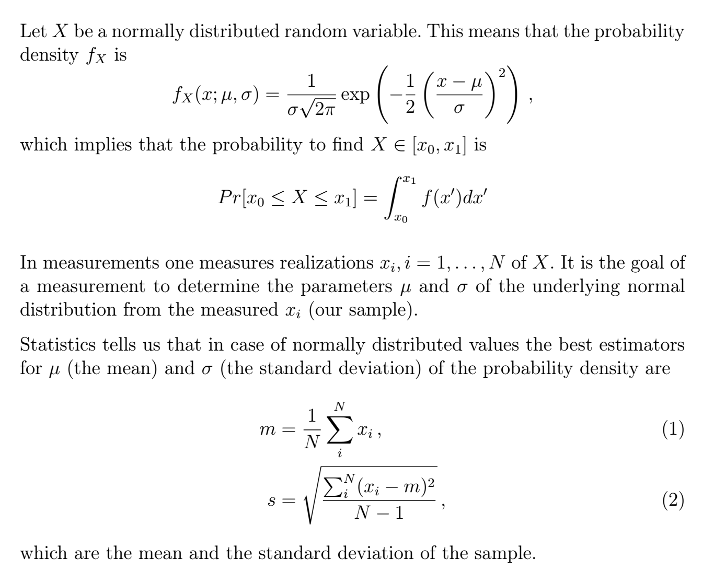
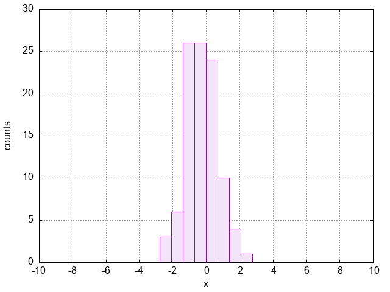

# Homework 01

Due until 10.05.2021, 12:30

Submit your modified *.cxx files and the plot that you create in problem 2 as png.

-----

## Problem 1
You are already familiar with the `cout` command to print
information to the console. Using a very similar command, you can
redirect output directly to a file. For this you have to include
the header file `fstream` and use an `ofstream` object,
as is demonstrated by the listing below.

```cpp
#include <iostream>
#include <fstream>

using namespace std;

int main(void)
{
 int a,b;

 // open file output.dat in order to write into it,
 // if the file already exists it will be overwritten
 ofstream out("output.dat");

 // Read input from console
 cout << "a = ";  cin >> a;      
 cout << "b = ";  cin >> b;

 cout << "a = " << a
      << "\t b = " << b << endl;   // Print to console
 out  << "a = " << a
      <<  "\t b = " << b << endl;  // Print to file

 out.close();

 return(0);
}
```
The formatting command ``\t`` prints
a tabulator in the respective position. After executing this program
a new file ``output.dat`` has been generated which contains all the things
you stuffed into ``out`` using the ``<<`` operator. The final command
``out.close()`` closes the file.

### Your assignment is:

Modify the program ***logmap.cxx*** (which is the solution to the problem to Lab 02) in the following way:
* Instead of iterating and printing the results (to the console) at the same time,
  modify your code such that first all calculations are done and only subsequently
  the results are written to the file. This means you will have to use an array to store
  calculated values.
* To keep things simple, you just have to store iteration results for one *r*
  value at a time. In the current program we carry out *Nskip* steps before we print
  values, i.e. you will need *Nend - Nskip* entries in your array.
* Insert an extra loop (inside the loop which modifies *r*) to print the values
  stored in the array to the file.
* Make sure your file is closed properly, i.e. if your file-handle is called ``out`` then
  do not forget the line ``out.close()``


-----

## Problem 2




The following C++ code generates *N* normally distributed measurement values:

```cpp
#include <random>

using namespace std;

int main()
{
    
    random_device rd; 
    mt19937 gen(rd()); 

    double mu = 0;
    double sigma = 1;
    normal_distribution<double> d(mu, sigma); 

    const int Nsample = 100;
    double sample[Nsample];

    for(i = 0; i < Nsample; i++)
        sample[i] = d(gen); 

}        
```

### Step 1:

Extend the code such that you calculate *m* and *s* from the values contained in the ```samples``` array. Obviously, these values should become more and more similar to *mu* and
*sigma* as you increase *N*. (Check!) 

### Step 2:

In order to visualize the sample distribution it is common to create a histogram from the
data. While there are tricks how to bin the data directly in gnuplot, we can easily perform
binning directly in our code. 

For a histogram, we have to divide the interval *[xmin,xmax]* into *Nbins* equally long
sub-intervals [x<sub>j,start</sub>, x<sub>j,start</sub> + dx] and count how many sample values lie within this subinterval. Use *Nbins= 50*. For our data, it seems reasonable to consider the interval *[xmin = -10, xmax = 10]*. 

In order to plot the data nicely in gnuplot, you need a file which contains two pieces of 
information per interval: first the lower interval edge and then the number of counts in 
that intervall.

Create a further array (next to the already existing ```samples``` array) in which you
count the number of occurences per interval. Then create the required output.


Example: data.txt
```
0 4
1 3
2 4
3 8
4 0
5 1
```
(4 values in the interval [0,1), 3 in [1,2) and so on)

The data can then be visualized in gnuplot via
````
gnuplot> plot 'data.txt' smooth freq w boxes 
````
Your plot should then look something like this:

